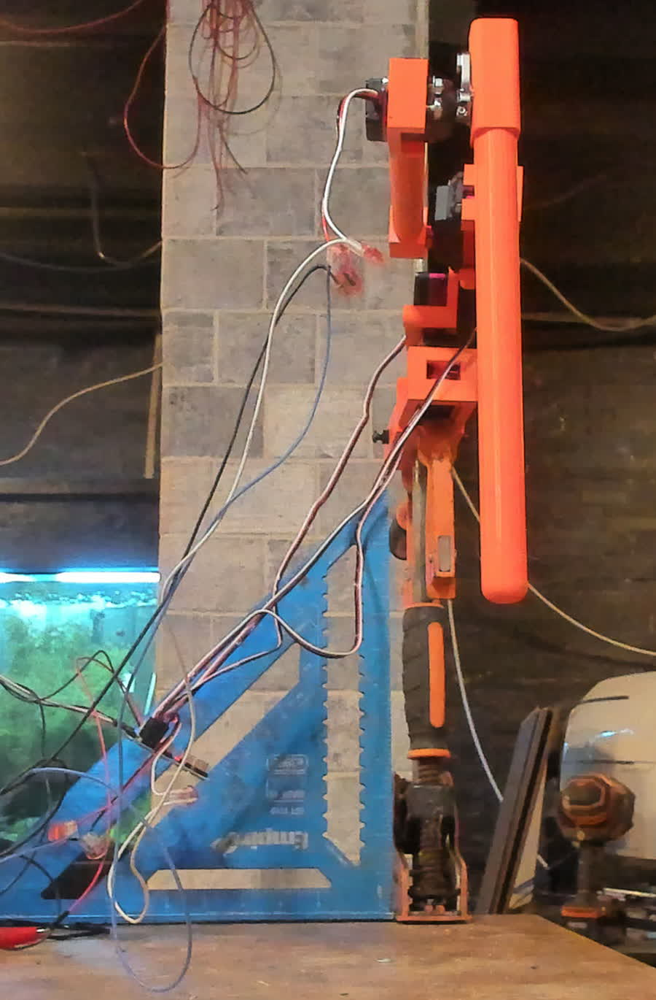
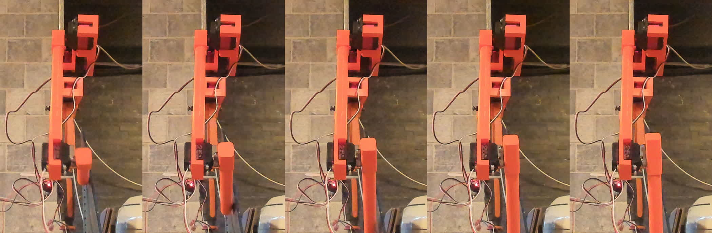
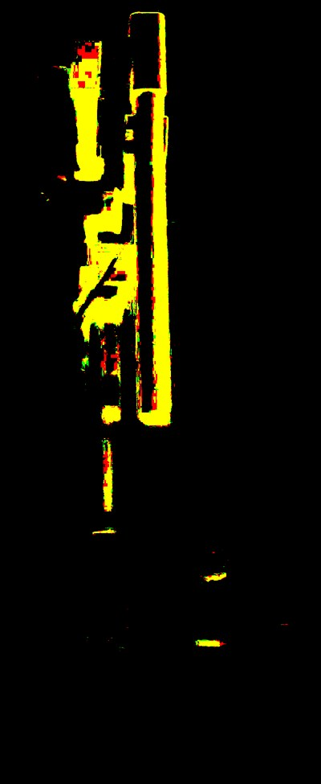
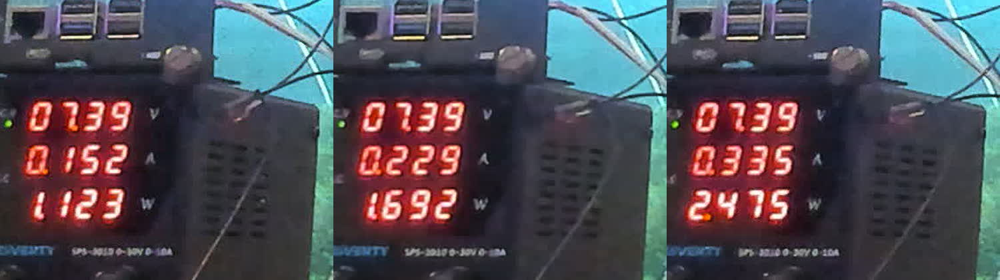
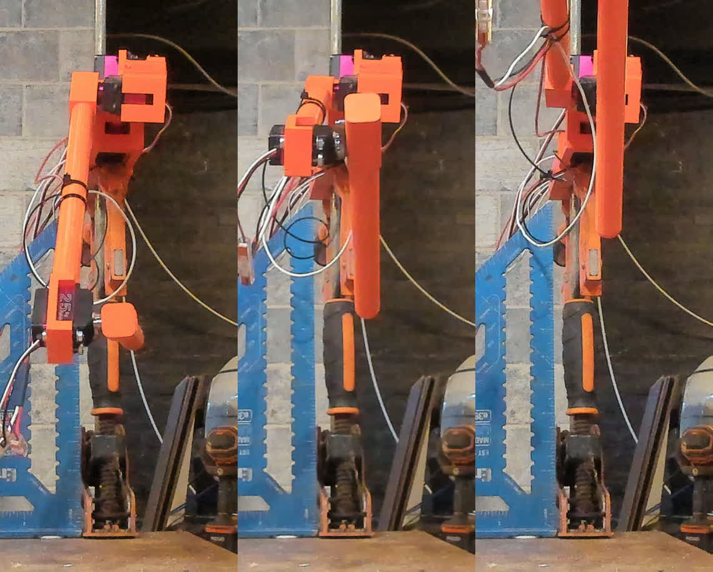
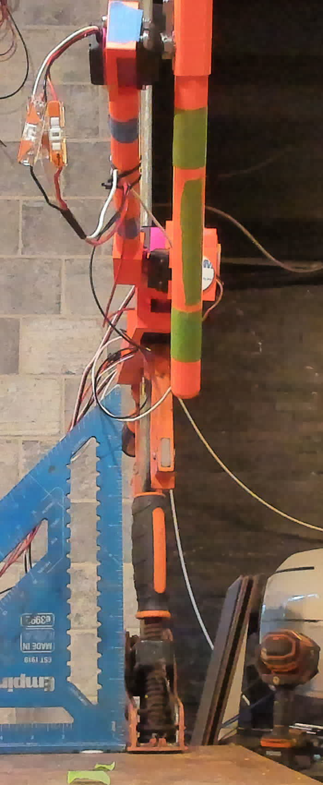
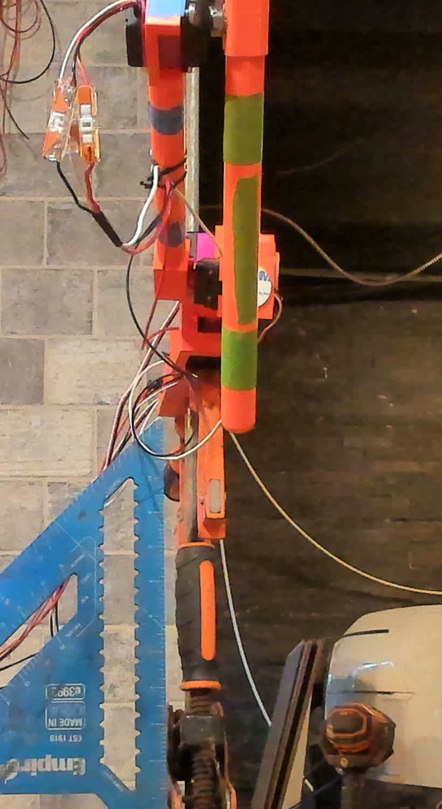

# Four ways a working servo looks dead

*Build log — 2026-09-26. Leg v2 on the bench, first powered runs.*

The goal for the evening was small: find out which way each joint turns when you raise the
pulse width. Four joints, four numbers. It took two days, and almost every measurement along
the way said the same thing — **nothing** — for four completely different reasons, only one of
which was a real fault.

That is the interesting part, so this is written in the order it happened rather than the
order that would make us look good.



## The setup

A single leg of a six-legged robot, clamped to a vertical rail over a workbench. Three
DS5180SG 80 kg·cm servos — coxa yaw, hip lift, femur — and one DS3225MG 25 kg·cm at the
tibia. They hang off a PCA9685 PWM breakout on a Raspberry Pi 5, running at 196.89 Hz.

There is no feedback. A hobby servo takes a pulse and tells you nothing. You command 1500 µs
and the joint goes… somewhere. Which is fine once you know the mapping, and the mapping is
exactly what we did not have: the leg was redesigned in Fusion and the new assembly came
across with no user parameters, so nothing in the model defines where zero is or which way
is positive.

So: measure it. Command a value, look at the leg, write it down.

## The first problem is that "look at the leg" needs a human

The first runs worked that way — command, ask, wait for an answer. It is slow, and worse, it
is unreliable in a specific direction: a person watching a joint that *doesn't* move cannot
distinguish "it didn't move" from "I looked away at the wrong moment."

So we pointed a webcam at the bench. Two, eventually — one across the room, one close and
square to the plane the leg swings in. Everything below was measured off those frames.



That worked immediately, and the first real result was a number instead of an impression:
frame-to-frame PSNR against a reference. Around **20 dB** when a joint visibly swung,
**33–36 dB** when it did not move at all. Not a judgement call any more.

## Dead end #1: it didn't move because the motor supply was switched off

The most ordinary explanation, and it took a while because every *other* indicator was
green. The Pi was up, the I²C bus was healthy, the PCA9685 answered, and a register read-back
confirmed the chip was generating a correct 1500.4 µs pulse with the right per-channel phase
stagger. The controller was doing its job perfectly into a rail with no power on it.



Worth noting what saved time here, because it generalises: proving the *pulse* was correct,
by reading the registers back, meant the fault had to be downstream of the board. That is a
cheap test and it cut the search space in half.

## Dead end #2: our own code never actually stopped anything

Then the bench supply — now in frame, so its display is readable from every capture — showed
something strange. Command channel 0: 0.152 A. Channel 1: 0.229 A. Channel 2: 0.335 A. A
satisfying ranking that matched mechanics: the coxa carries no gravity torque, the hip lift
more, the femur most.



It was cumulative. Those are not three per-channel measurements, they are one channel, then
two, then three, all still energised. The tidy story was an artifact.

The cause was a one-character bug:

```python
[on & 0xFF, (on >> 8) & 0x0F, off & 0xFF, (off >> 8) & 0x0F]
```

On a PCA9685 the high byte of `LEDn_OFF_H` holds the count's top nibble in bits 0–3 — and
**`FULL_OFF` in bit 4**. Masking with `0x0F` deletes precisely the bit that stops the output.
`channel_off()` had been a silent no-op all evening. And the wrapper made it worse by calling
`all_off()` *first* and then sixteen per-channel writes, overwriting the stop it had just
issued.

The tool's docstring advertised that every command self-releases after a fixed dwell, which
is a genuine safety property for driving a mechanism you have no map for. It was not true. A
safety guarantee that has never been tested is a comment.

## Dead end #3: the supply's current limit was set near idle

With that fixed, the readings still pinned at ~0.335 A no matter what was commanded —
including channels with nothing plugged into them, and after a confirmed release. That is
what a supply in constant-current mode looks like: you are reading the limit, not the load.

Two habits came out of this. Watch the CV/CC indicator, not just the numbers. And set a
current limit deliberately — short the leads, set the current, remove the short — rather than
leaving whatever was there from the last project.

## Dead end #4: a brand-new servo, working perfectly, drawing nothing visible

The last one is the best, because the instrument was the problem.

A new 25 kg servo went straight onto channel 3. Commanded 1200, 1500, 1800 — the supply read
**0.023 A, flat, at every value**. By now the reasoning was practised: no current, no motion,
therefore not driven.

It was working. It moved on the first command, every time. An unloaded servo's holding
current is almost nothing, and its motion surge lasts about 0.2 seconds — so a single still
frame of the meter, grabbed a second into a seven-second hold, reads idle. The bench supply's
display averages and updates a few times a second, which flattens the transient even when you
do catch it.

**A measurement that reads "nothing" is the weakest possible evidence, because every failure
of the instrument also reads "nothing."** Four times in one evening, from four unrelated
causes. Confirm a negative against a second, independent channel before acting on it.

## What was actually broken

One thing: a buck converter and the splices around it, feeding the tibia servo its own 6 V.
The servo was fine. The channel was fine. Both had been convicted on the evidence above.

## The finding that changes the design

Along the way, something genuinely new. With every channel read back as `FULL_OFF` — the chip
generating no pulses at all — the supply still drew **0.239 A against a 0.023 A cold idle**.
Roughly 72 mA per servo, being sent nothing.

Confirmed by hand, which is the better instrument for this question: **the joints cannot be
forced at all while the rail is live**, signal or no signal. Cut the rail and they become
back-drivable — though not limp; gearbox friction still holds the leg's pose, and that hold is
load-dependent. The same leg went flat two days earlier with the tibia extended, roughly
double the moment about the hip.

Three states, not two:

| state | behaviour |
|---|---|
| rail off | friction holds the pose; back-drivable by hand with effort |
| rail on, no signal | actively holding; cannot be forced |
| rail on, commanded | actively holding; cannot be forced |

This matters because the safety architecture assumed the opposite. The design has a hardware
reflex tier whose emergency stop pulls the PCA9685's `OE` line high, and a software E-stop
that writes a single all-call register to kill all 32 channels at once. Both stop *pulses*.
Neither removes torque from a servo that holds its last position when the signal disappears.

**A real emergency stop on this machine needs a power path** — a relay or a high-side MOSFET
on the servo rail — not just a signal path.

It cuts the other way too, and in our favour: a robot that holds position when the signal
dies is a robot that stays standing when its controller crashes mid-stance.

## What the camera can and cannot do

By the end it is a real instrument, with known limits.

- **Mask on saturation, not hue.** Under incandescent shop light the brick, the bench and skin
  all read orange. The printed parts measured S=176 against 53 for brick and 67 for the bench.
  Saturation separates them; hue does not.
- **A speed square in frame is worth more than a ruler.** Its 90° corner photographed as
  **90.37°**, which says the camera is square to the leg's swing plane to within half a
  degree — so every angle measured off those frames is real. An oblique view under-reads every
  angle and would happily report a 270° servo as a 180° one. Scale comes free from the known
  link lengths; the right angle is the thing you cannot get any other way.
- **A single still cannot see a transient.** Use video, or load the joint.
- **A BRIO exposes four `/dev/video*` nodes and only the first is the camera** — the third is
  a 340×340 greyscale infrared sensor for face unlock. Capture from it and you get a tiny
  monochrome image that a vision model will confidently describe as a dark room. And the first
  frame is underexposed: 67 KB versus 368 KB for the same scene twelve frames later. Both
  failures return a plausible image, which is the worst kind.

One more, filed with a family of mistakes worth naming:

> A least-squares circle fitted through five tracked points returned a **0.24 px residual** —
> a beautiful number. Every one of those points was the bottom edge of the crop box rather
> than the object being tracked; five nearly-collinear points fit almost any large circle.
> **A fit statistic cannot tell you it measured the wrong thing.**

## Where it ends up

The femur's direction is settled — rising pulse width rotates it up, unmistakably, across
1300 → 1500 → 1700.



But the last obstacle is almost funny: every link on the leg is printed in the same orange, so
the mask finds "the leg" and cannot tell the hip arm from the femur from the folded-back
tibia. Measuring a bar's tilt is useless if you cannot be sure which bar you measured.

The fix is a minute with a roll of tape. Green rings on the tibia, blue on the femur, white
dots on the hip arm — fiducials, so each link can be isolated by colour and every joint angle
becomes a direct measurement.



And the structural result the evening was really for, which arrived almost as an aside: with
the femur plumb and the contact centred under it, the leg took **10 kg** with no fold. The
whole robot is 5.3–6.0 kg, a walking tripod puts about 2 kg on a leg, and the previous
revision's hip mount snapped at **0.30 kg**.



## Postscript: the fifth way

Three markers and neutral light did work. The tibia swept cleanly across four pulse widths,
and with a link of known orientation in frame — the tibia set physically perpendicular to the
benchtop — the whole chain validated to **better than one degree**. The slope came out at
**0.1241 °/µs**, or 248° across the full 500–2500 µs pulse range, which settles a question
that had been an assumption under every joint limit in the model: these are **270° servos**,
and the real figure is **8.06 µs per degree** against the 7.41 the plan assumed. Nine percent
optimistic, in the direction that lets you command past a mechanical stop.

Then the hip arm broke.

Sweeping the hip lift from 1600 to 1700 µs fractured the printed arm. The leg was in the air,
so self-weight was about 10 kg·cm — a tenth of what that servo can produce. It had driven the
arm into its own mechanical limit and kept pushing for the full seven-second dwell.

The part is a reprint. The interesting bit is *how* the guard went missing. The bench supply's
current had been the instrument of the evening — it caught the cumulative-current bug and the
constant-current clamp, and it is the only signal that separates *moving* from *pushing
against a stop*. Measuring joint angles meant switching to the profile camera. The profile
camera cannot see the supply. So the meter left the loop, silently, at precisely the moment
the work moved from "read a value" to "find out where the travel ends."

Nothing failed. No check went red. The stall detector was never a component that could be
reported missing — it was a habit, and habits do not raise alarms when you stop practising
them.

Which is the fifth way a thing can look fine: **the measurement that would have caught it was
no longer being taken.**

Next: a reprinted arm, current monitoring wired into the sweep, and a dwell short enough that
an unknown pulse width cannot be held against a stop.
